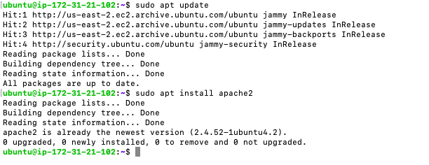
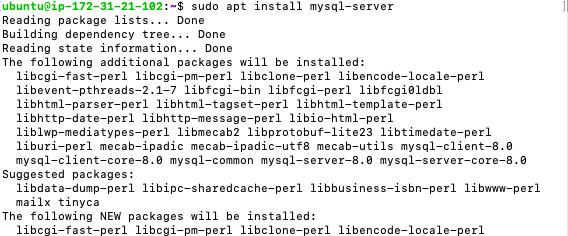
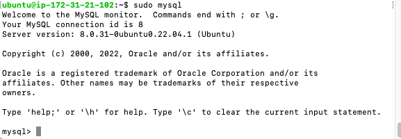
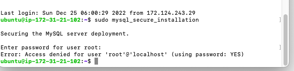
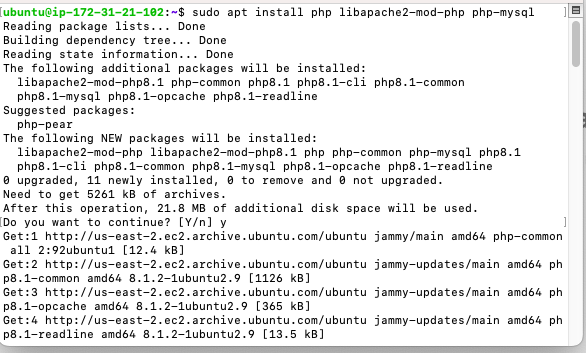
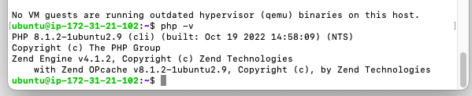

## Documentation of Project 1

**Command/Installation performed with output**

`sudo apt update`

`sudo apt install apache2`

`sudo apt install mysql-server`

`sudo mysql`

`sudo mysql_secure_installation`

`sudo apt install php libapache2-mod-php php-mysql`

`php -v`

`sudo mkdir /var/www/projectlamp`

`sudo ls /etc/apache2/sites-available` 

`sudo echo 'Hello LAMP from hostname' $(curl -s http://169.254.169.254/latest/meta-data/public-hostname) 'with public IP' $(curl -s http://169.254.169.254/latest/meta-data/public-ipv4) > /var/www/projectlamp/index.html`

`sudo vim /etc/apache2/mods-enabled/dir.conf`

